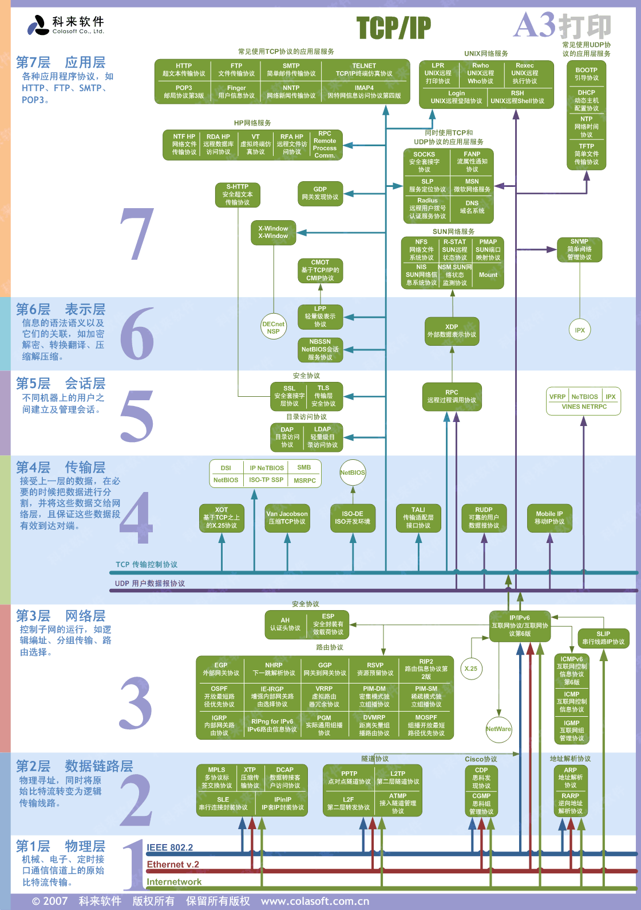

# 网络协议笔记
## 定义
### 百度百科:网络协议为计算机网络中进行数据交换而建立的规则、标准或约定的集合。
## 常用协议
### 1. 物理层 
底层物理连接介质。负责发送电信号高电压对应数字1，低电压对应数字0。两个物理层通过**光缆\电缆\双绞缆**等介质连接(电信号)
### 2. 数据连理层 
数据链路层的功能：定义了电信号的分组方式,ethernet规定:一组电信号构成一个数据包，叫做‘帧’(帧)
#### 协议
1. PPP
2. RARP

### 3. 网络层
引入一套新的地址用来区分不同的广播域／子网，这套地址即网络地址
#### 协议
1. IP
2. ARP

### 2. 传输层
传输层的由来：网络层的ip帮我们区分子网，以太网层的mac帮我们找到主机，然后大家使用的都是应用程序，你的电脑上可能同时开启qq，暴风影音，等多个应用程序，那么我们通过ip和mac找到了一台特定的主机，如何标识这台主机上的应用程序，答案就是端口，端口即应用程序与网卡关联的编号。
#### 协议
1. TCP
2. UDP
### 1. 应用层

#### 协议
1. HTTP 超文本传输协议(HyperText Transfer Protocol)
2. TELNET 远程登录协议
3. FTP 文件传输协议
5. SMTP 简单邮件传输协议 (Simple Mail Transfer Protocol, SMTP)
6. POP 邮局协议(Post Office Protocol)
7. IMAP 交互邮件访问协议(Internet Mail Access Protocol)
8. RPC 远程过程调用协议(Remote Procedure Call)

## 图片

## 参考
1. [网络协议(百度百科)](https://baike.baidu.com/item/%E7%BD%91%E7%BB%9C%E5%8D%8F%E8%AE%AE/328636?fr=aladdin)
2. [网络通信协议](https://blog.csdn.net/qq_23541951/article/details/81237904)
3. [网络基础之网络协议篇(一)](https://blog.csdn.net/hegui1997/article/details/80927610)
4. [详解三次握手和四次挥手：遇到心动的女孩时，如何去把握？](https://mp.weixin.qq.com/s?__biz=MjM5NzMyMjAwMA==&mid=2651483981&idx=1&sn=3351f2461ab2b7c7d690dcc65137ae65&chksm=bd2503328a528a247d7a117aeedb1c3c6198a0b3fa8dc6fe67bc657ddf988455bfa0b197ba30&mpshare=1&scene=1&srcid=08092whCoDifIA7xqHU5ev35&sharer_sharetime=1565354068307&sharer_shareid=e3504e1944eb3dd430f519b6bb0b06d7&key=4062b15c04f483fc64120318c019401a9c6b2dba71d05a50eb74ab762968c0e37d32b128e61bfbaa9b575f909d66da0e25c776a8166e5163714cc38d4590b49aba4c305ad3fc294e77ae0b10b064ee97&ascene=1&uin=MTQwNzUzNTMxMw%3D%3D&devicetype=Windows+10&version=62060844&lang=en&pass_ticket=ksKvBYRB8LPipYBQD7ex8Kz7cJvijbhanMOr5aigxvu1jIEIlvsWoofH86kIUFUN)
5. [如何学习 TCP 协议](https://mp.weixin.qq.com/s?__biz=MjM5NzMyMjAwMA==&mid=2651479263&idx=1&sn=4ac285aad50ca4c495129ff664528d9e&chksm=bd2530a08a52b9b6451c9ab50a214c98a09ee661e3f179a12f7d2d52b7313c35b633b9439f6a&mpshare=1&scene=1&srcid=0809yJFJH5W3XWXbxQrBCGLk&sharer_sharetime=1565353986479&sharer_shareid=e3504e1944eb3dd430f519b6bb0b06d7&key=4062b15c04f483fc72e61b811e72f4c68c9a8dae775dda2e2b1be51ae7e223b9bed01fa0876d3fbde8837273bfd2dc308adbca1cc10cd4f0f9edab85df80eae45f8282159c058990c0a22bd859231cbf&ascene=1&uin=MTQwNzUzNTMxMw%3D%3D&devicetype=Windows+10&version=62060844&lang=en&pass_ticket=ksKvBYRB8LPipYBQD7ex8Kz7cJvijbhanMOr5aigxvu1jIEIlvsWoofH86kIUFUN)
6. [如何给老婆解释什么是RPC](https://www.jianshu.com/p/2accc2840a1b)